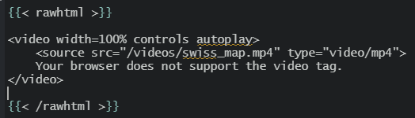

### Introduction

For the needs of the project (see in the Projects tab) Swiss map, namely to insert a personal video and not from Youtube or vimeo or others, it was not easy to find the information.

While browsing the site of Alison Hill, designer of the Hugo Apéro theme, unfortunately, I could not identify the code under rmardown to insert a personal video.

By browsing the topic on the internet I was able to find the information.

### How to proceed step by step

The site on which I found the information is the following: https://iamsorush.com/posts/add-video-to-hugo-post/ (developed by M.Khajepor, researcher and developer).  
Here is his approach that I have taken in your entirety. I thank him very much for his approach.

First, you need to create a **rawhtml.rhtml** file in the shortcodes directory:

```toml
...\themes\hugo-apero\layouts\shortcodes
```
In this html file, you have to type the following code:

```toml
<!-- raw html -->
{{.Inner}}
```
Now it is possible to write in the specific file (**index.md**) where you want your video to appear, the following code: 



We can see that it is a video in mp4 format.


