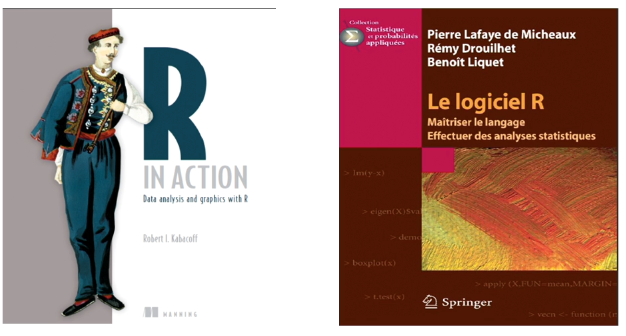

## [Découvrir R](https://www.linkedin.com/learning/decouvrir-r) is based on these 2 books available for free on the internet.

---
## Comments
This online course covers the step by step basics of statistics at the end of compulsory schooling. 
It is treated with R for example the operations on :
- data frames
- dates
- matrices, vectors
- etc.

A very interesting and useful course for those who want to learn about programming with R.