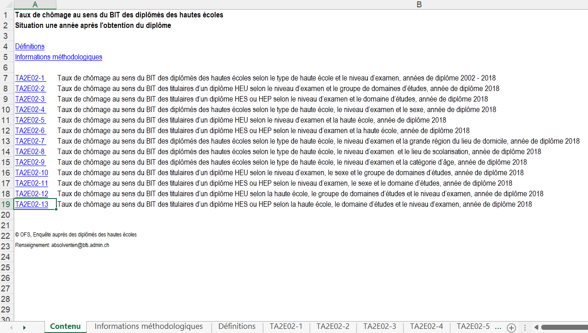
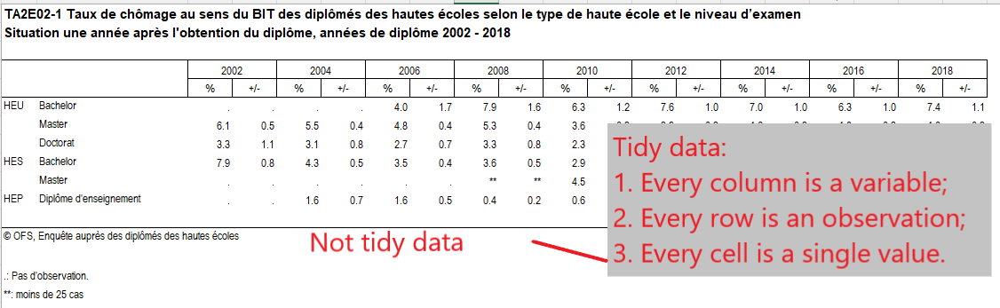
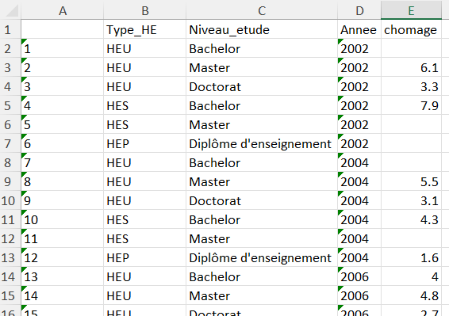
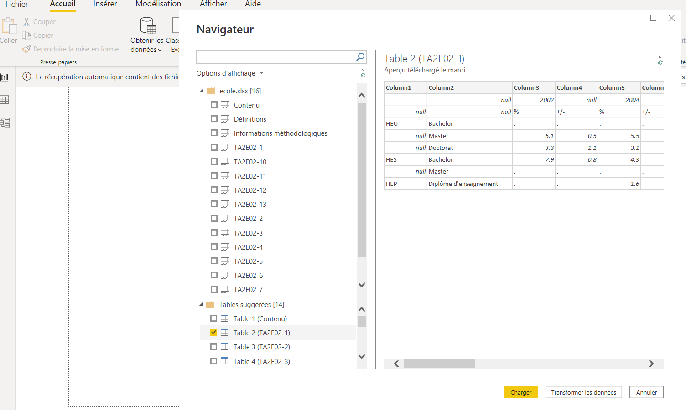
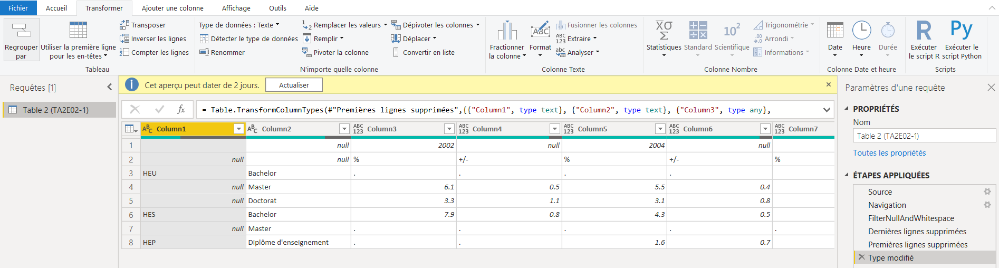
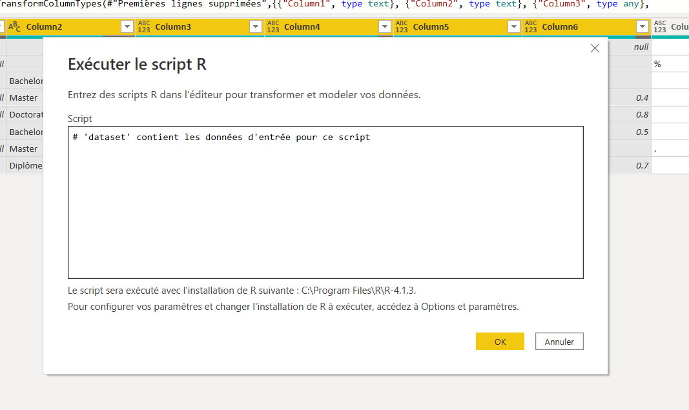
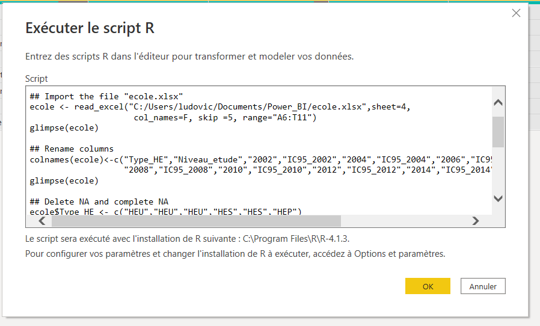
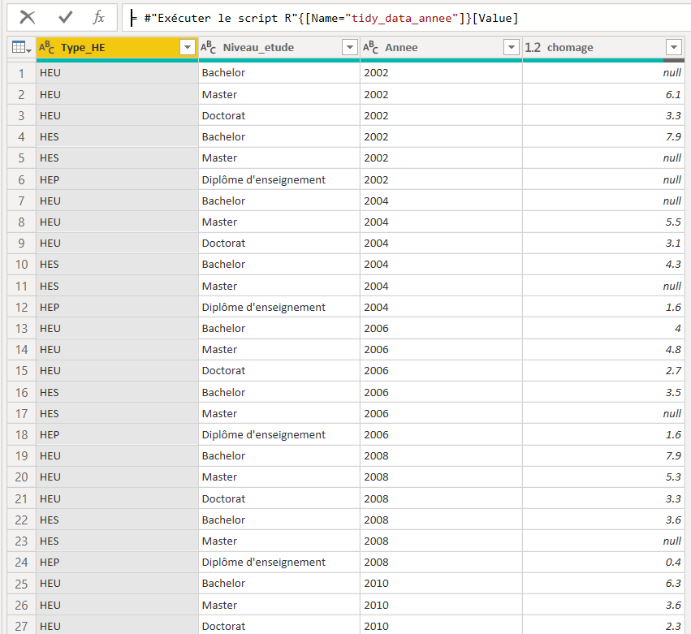
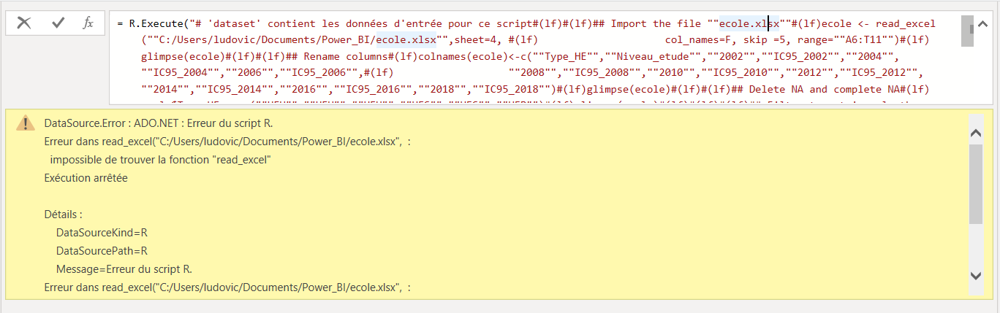

---

### The objective of this project is multiple: Firstly, to discover the functionality of the R option in Power BI Desktop. Secondly, it is to see the limitations of Power BI Desktop in wrangling (cleaning) a dataset, a crucial step before visualizing this dataset.

---

### Approach
In order to fully meet the objective of this project, a dataset from opendata.swiss was chosen. This dataset is entitled **"Taux de chômage au sens du BIT des diplômés des hautes écoles une année après l'obtention du diplôme""**.  
This dataset can be found on the portal of the Federal Statistical Office at the following address: https://www.bfs.admin.ch/bfs/fr/home/statistiques/education-science/integration-marche-travail/tertiaire-hautes-ecoles/taux-chomage-sens-bit.assetdetail.13667400.html 

### Dataset
The dataset used and mentioned in the chapter "Approach" is in xlsx format. It is composed of 15 tabs and organised as follows: 


Initially, the tab that will interest us and that we will use concerns the TA2E02-1:


We can see that the tabs used are not tidy data. The next step is to clean this dataset to make it usable (tidy). 

### Wrangling
There are two options for cleaning in this project:

- R with the RStudio IDE;
- Power BI Desktop.

#### RStudio
Thanks to some packages (tidyverse, openxlsx,...), it will be possible to turn the initial dataset into a tidyed one. Let's go!

```toml
## Install package openxlsx
install.packages("openxlsx")

## Loading package tidyverse and readxl
library("tidyverse")
library("openxlsx")
```
```toml
## Import the file "ecole.xlsx"
ecole <- read_excel("C:/Users/ludovic/Documents/Power_BI/ecole.xlsx",sheet=4, 
                     col_names=F, skip =5, range="A6:T11")
glimpse(ecole)
```
```toml
## Rename columns
colnames(ecole)<-c("Type_HE","Niveau_etude","2002","IC95_2002","2004","IC95_2004","2006","IC95_2006",
                   "2008","IC95_2008","2010","IC95_2010","2012","IC95_2012","2014","IC95_2014","2016","IC95_2016","2018","IC95_2018")
glimpse(ecole)

## Delete NA and complete NA
ecole$Type_HE <- c("HEU","HEU","HEU","HES","HES","HEP")
glimpse(ecole)
```
```toml
## Filter to retain only the years and not the IC95% 
ecole <- ecole %>%
  select(Type_HE,Niveau_etude,"2002","2004","2006","2008","2010","2012","2014","2016","2018")
glimpse(ecole)

## Make tidy_data with gather function
tidy_data_annee <-gather(ecole,Annee,chomage, -Type_HE,-Niveau_etude)
glimpse(tidy_data_annee)
```
```toml
## Changing the typing of the "chomage" column to double
tidy_data_annee$chomage <- as.double(tidy_data_annee$chomage)
glimpse(tidy_data_annee)
```
```toml
## Export file xlsx
write.xlsx(tidy_data_annee, file="ecole1.xlsx", sheetName = "Sheet1", 
           colNames = TRUE, rowNames = TRUE, append = FALSE)
```
Here is the result in image form:  
  

#### Power BI
Let's import the file named **"ecole.xlsx"** with the tab **TAE2E02_1**
  

Click on the **"Transformer les données"** button.  

Through the tools available to clean up the dataset (*Transformer/Tableau/Transposer; Transformer/N'importe quelle colonne/Remplir, ...*) it will be very difficult to perform this operation.

So if we choose the **"Transformer"** option and the **"Exécuter le script R"** option we could try to clean up.  
 

By selecting **"Exécuter le script R"**, we open a window allowing us to write a script in R. 
Unfortunately, this open window does not work like an R editor. There is no button to execute certain lines or parts of the code. We have to type in the whole code to do the cleaning. 

 

Now just copy and paste the RStudio code and insert it into this Power BI window. 
There is no need to install the necessary package(s) unless they are not installed in RStudio. However, you do need to load the relevant packages.

 

By pressing the **"OK"** button, Power BI will execute the code. A new window will appear showing 2 tables.
- **the original table --> ecole**
- **the final (cleaned up) table --> tidy_data_annee**

 


If a programming error is present, a message in a yellow window will appear to explain where the error is located.

 


