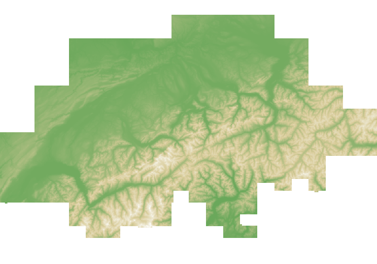

### [Rayshader](https://www.rayshader.com/) is an open source package for producing 2D and 3D data visualizations in R. rayshader uses elevation data in a base R matrix and a combination of raytracing, hillshading algorithms, and overlays to generate stunning 2D and 3D maps. In addition to maps, rayshader also allows the user to translate ggplot2 objects into beautiful 3D data visualizations. (*source: https://www.rayshader.com*)

---

### Approach

The objective of this project (map of Switzerland) is in line with another ongoing project, a project to study the evolution of the average temperature in Switzerland since 1931.  
Looking to add an illustration for this temperature project, I searched the web. Then, I found the rayshader package, which I must admit I was immediately enthusiastic about. 

### The difficult beginnings
Not knowing this package and its specificities, it took me several weeks to identify how to start this project. From the official website rayshader and more precisely the section **Tutorials/Blog posts**, by examples I learned the language and the specificities of this package, a priori easy but which proved to be more complicated than I thought.  
According to the official site, Mr Tyler-Phd (inventor of this package) uses a **tif** file format. However, according to my researches, I went on the site of the **Federal Office of Topography - swisstopo (Switzerland)** proposing quality maps (mesh) of different file format. 

### Choice of the altitude model


Finally, my most appropriate choice, as it does not generate a large amount of data (200 meter mesh), was the MTN25/200m model. The format was **ESRI ASCII GRID**, a common format in geolocation.


### How to create a map step by step


The first step is to install the latest updates of the package and load.

```toml
# To install the latest version from Github:
install.packages("devtools")

# Installation and loading of packages
install.packages("av")
library(rayshader)
library(raster)
library (ambient)
library(av)
```
The second step is to "rasterize" the imported file (asc format).

```toml
# Source file, format: ESRI ASCII GRID
swiss <- raster("C:/Users/ludovic/Documents/R/swisstopo/MTN25_200m/DHM200.asc")
```
Then 

```toml
# Transform source file into a regular R matrix
swiss_mat<- raster_to_matrix(swiss)
```

In order to quickly view our asc file, we need to resize the file.

```toml
# Create small version of matrix for quick visual prototyping
swiss_small<- resize_matrix(swiss_mat,0.5)
```
Now it is possible to visualize the desired map.

```toml
# Plot the small version of matrix using basic color defaults
swiss_small %>% 
height_shade() %>% 
plot_map()
```


The main point of the rayshader package is to add functions such as adding water or sunlight. These functions work on the same principle as ggplot2.

```toml
# Improve the mapping by adding functions
# Add snow peaks 
snow_palette = "white"
snow_hs = height_shade(swiss_mat, texture = snow_palette)
```

```toml
swiss_small %>% 
  height_shade() %>% 
  add_water(detect_water(swiss_small,zscale=40,min_area=2000),color="#02bdb5") %>%
    add_overlay(sphere_shade(swiss_small, texture ="imhof1",
                           zscale=7, colorintensity = 30, sunangle=45), alphalayer=0.8) %>%
  add_shadow(lamb_shade(swiss_small,zscale = 50),0.3) %>%
  add_shadow(ambient_shade(swiss_small), 0.1) %>%
  add_shadow(texture_shade(swiss_small,detail=10/10,contrast=9,brightness = 50), 0.01) %>%
  add_overlay(generate_altitude_overlay(height_shade(swiss_small, texture = "#91aaba"),
                                        swiss_small,start_transition = -300,end_transition = 500)) %>%
  add_overlay(generate_altitude_overlay(snow_hs, swiss_small, 2000, 4500, lower=FALSE)) %>%
  add_shadow(cloud_shade(swiss_small,zscale = 2, start_altitude = 1000, end_altitude = 4000, 
                         sun_altitude = 45, attenuation_coef = 0.2, offset_y = 300,
                         cloud_cover = 0.5, frequency = 0.08, scale_y=3, fractal_levels = 16), 0.5)%>%
```
Now we can plot the map.

```toml
plot_3d(swiss_small, zscale = 50,baseshape = "rectangle", fov = 120, 
        windowsize=c(1600,900), theta = 15, zoom = 0.5, phi = 45, watercolor="#02bdb5")
```
In the package there is a function to take a snapshot adding a text and being able to modify the font, the color, etc...

```toml
render_snapshot(title_text="SWISS MAP by L.Perruchoud",title_size=40,vignette=T,title_font = "Helvetica",title_offset=c(0,20),
                title_color = "white", title_bar_color = "black", title_position = "north")
```

### How to create a video map step by step

To convert the map of the Swiss into video, some parameters must be set such as frames, frames per seconds (fps), etc...

```toml
# render movie
if(interactive()) {
  filename_movie = tempfile()
  
# Improve the mapping by adding functions
# Add snow peaks 
snow_palette = "white"
snow_hs = height_shade(swiss_mat, texture = snow_palette)

# Improve the mapping by adding functions
swiss_small %>% 
  height_shade() %>% 
  add_water(detect_water(swiss_small,zscale=40,min_area=2000),color="#02bdb5") %>%
    add_overlay(sphere_shade(swiss_small, texture ="imhof1",
                           zscale=7, colorintensity = 30, sunangle=45), alphalayer=0.8) %>%
  add_shadow(lamb_shade(swiss_small,zscale = 50),0.3) %>%
  add_shadow(ambient_shade(swiss_small), 0.1) %>%
  add_shadow(texture_shade(swiss_small,detail=10/10,contrast=9,brightness = 50), 0.01) %>%
  add_overlay(generate_altitude_overlay(height_shade(swiss_small, texture = "#91aaba"),
                                        swiss_small,start_transition = -300,end_transition = 500)) %>%
  add_overlay(generate_altitude_overlay(snow_hs, swiss_small, 2000, 4500, lower=FALSE)) %>%
  add_shadow(cloud_shade(swiss_small,zscale = 2, start_altitude = 1000, end_altitude = 4000, 
                         sun_altitude = 45, attenuation_coef = 0.2, offset_y = 300,
                         cloud_cover = 0.5, frequency = 0.08, scale_y=3, fractal_levels = 16), 0.5)%>%

# Plot 3d
plot_3d(swiss_small, zscale = 50,baseshape = "rectangle", fov = 120, 
        windowsize=c(1600,900), theta = 15, zoom = 0.5, phi = 45, watercolor="#02bdb5")
render_camera(theta=2,phi=60, zoom=0.31, fov=100)

# Take an official snapshot
render_snapshot(title_text="SWISS MAP by L.Perruchoud",title_size=40,vignette=T,title_font = "Helvetica",title_offset=c(0,20),
                title_color = "white", title_bar_color = "black", title_position = "north")
 

  render_movie(filename = filename_movie, type = "oscillate", 
              frames = 300,  phi = 60, zoom = 0.31, theta = 15, fov=120,
               title_text = "Swiss map by L.Perruchoud")
              
 filename_movie = tempfile()
  
 
 rgl::rgl.close()
   
}
```
 

<video width=100% controls autoplay>
    <source src="/videos/swiss_map.mp4" type="video/mp4">
    Your browser does not support the video tag.  
</video>



